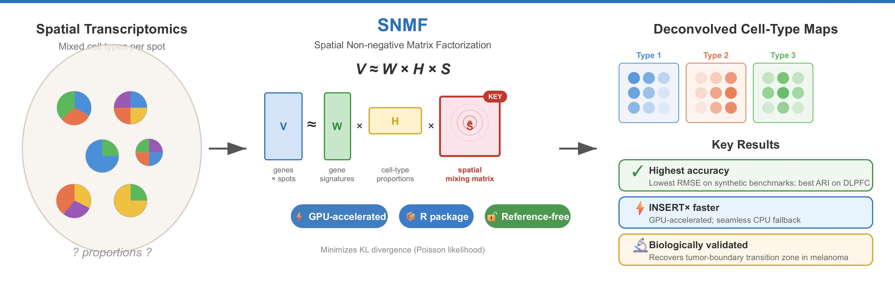

# SNMF: Ultrafast, Spatially-Aware Deconvolution for Spatial Transcriptomics

<p align="center">
  
</p>

**SNMF (Spatial Non-negative Matrix Factorization)** is a rapid, accurate, and reference-free deconvolution method for sequencing-based spatial transcriptomics data. It extends classical NMF with explicit spatial modeling and is the first spatial transcriptomics deconvolution tool to natively support GPU acceleration, while providing a seamless CPU fallback.

This repository contains the official implementation accompanying the paper:

> **SNMF: Ultrafast, Spatially-Aware Deconvolution for Spatial Transcriptomics**

---

# Repository overview

This repository contains all the code needed to replicate all the results in the paper.

## High-Performance Computing Environment

All experiments in the manuscript were executed on the [**DIPC Hyperion cluster**](https://scc.dipc.org/docs/systems/hyperion/overview/) (Donostia International Physics Center, Spain), a high-performance computing (HPC) environment designed for large-scale scientific workloads.

### Cluster Specifications (Hyperion)

- **Scheduler:** SLURM workload manager  

- **Compute Nodes:**  
  - **CPU-only nodes:**  
    - Intel Xeon Gold/Ice/Platinum series  
    - 48–128 cores per node  
    - 96 GB–2 TB RAM per node  

  - **GPU nodes:**  
    - NVIDIA GPUs: RTX 3090 (24 GB), A100 PCIe/SXM4 (80 GB), RTX A6000 (48 GB)  
    - Typically paired with Intel Xeon Gold/Ice/Platinum CPUs, 48–64 cores, 96 GB–2 TB RAM  

- **Interconnect:** InfiniBand HDR high-speed network  
- **Parallel file system:** Lustre  

- **Notes:**  
  - RTX 3090 GPU nodes are used for benchmarks to avoid giving an exaggerated performance advantage that might result from higher-end GPUs (A100, A6000).  
  - Node selection should consider memory, CPU cores, and GPU availability depending on workload requirements.  

All benchmarking experiments were run in batch mode through SLURM, ensuring reproducibility and scalability.

---

## Designed for SLURM-Based HPC Systems

All the code in this repository has been explicitly designed for execution in **SLURM-managed HPC environments**, with:

- Non-interactive execution support  
- Scriptable workflows  
- Deterministic seeding for reproducibility  

---

## Data

All the data used for the different experiments in this repo can be downloaded from Zenodo [here](https://doi.org/10.5281/zenodo.18852117).

---

# Results

The results published in the manuscript can be classified into three main sections: ablation study, benchmarking and biological validation.

## Ablation study

A bash script has been developed in order to seamlessly run the ablation study. You can run it by:

```bash
cd ./results/ablation_study
nohup bash ./run.sh &
```

## Benchmarking

The methods included in the benchmarking are: CARD, STdeconvolve, SMART, RETROFIT, BayesTME, SpiceMix and Starfysh.

Legend:  
- ✅ = Yes  
- ❌ = No  
- ➖ = Not reported / Not applicable  

| Method | Lang | MGs¹ | Annotates | All CTs | Package | GPU | Spatial |
|--------|------|------|-----------|---------|---------|-----|---------|
| **CARD²** (2022, *Nat. Biotechnol.*) | R | ✅ | ❌ | ➖ | ✅ | ❌ | ✅ |
| **STdeconvolve** (2022, *Nat. Commun.*) | R | ❌ | ✅ | ❌ | ✅ | ❌ | ❌ |
| **SpiceMix** (2023, *Nat. Genet.*) | Python | ❌ | ❌ | ➖ | ✅ | ✅ | ✅ |
| **Starfysh³** (2025, *Nat. Biotechnol.*) | Python | ❌ | ✅ | ✅ | ✅ | ✅ | ❌ |
| **BayesTME** (2023, *Cell Syst.*) | Python | ❌ | ❌ | ➖ | ✅ | ❌ | ✅ |
| **SMART** (2024, *Genome Biol.*) | R | ✅ | ✅ | ✅ | ✅ | ❌ | ❌ |
| **RETROFIT** (2023, *bioRxiv*) | R | ❌ | ✅ | ✅ | ✅ | ❌ | ❌ |
|  |  |  |  |  |  |  |  |
| **Not included in benchmark** |  |  |  |  |  |  |  |
| **UniCell Deconvolve⁴** (2023, *Nat. Commun.*) | Python | ❌ | ✅ | ❌ | ✅ | ✅ | ❌ |
| **MUSTANG⁵** (2024, *Cell*) | Python/R⁶ | ❌ | ❌ | ➖ | ❌ | ❌ | ✅ |
| **CellsFromSpace⁵** (2024, *Bioinformatics*) | R | ❌ | ❌⁷ | ➖ | ❌ | ❌ | ❌ |
|  |  |  |  |  |  |  |  |
| **SNMF (this work)** | **R** | ❌ | ❌ | ➖ | ✅ | ✅ | ✅ |

1. **MGs (Marker Genes)**: Counted only if they directly inform deconvolution (not just post-hoc annotation).  
2. **CARD** is primarily reference-based; here evaluated in its marker-based reference-free mode.  
3. **Starfysh** can accept marker genes but was run without user-provided markers in our benchmark.  
4. **UniCell Deconvolve** excluded: zero-shot method with fixed predefined cell types (*k* not user-defined).  
5. **MUSTANG** and **CellsFromSpace** excluded: no usable software package available at benchmarking time.  
6. **MUSTANG** requires both R and Python; cannot run fully in one language alone.  
7. **CellsFromSpace** does not automatically annotate components; provides interactive manual annotation instead.

### Run pipeline

In order to run the benchmark pipeline with default parameters, run the following command:

```bash
nohup bash ./benchmark.sh \
    --data_path=[DATA_PATH] \
    --markers_path=[MARKER_GENES_PATH] \
    --output_path=[OUTPUT_PATH] \
    --k=[K] \
    --proportions_path=[PROPORTIONS_PATH] \
    --hungarian=[true|false] &
```

For instance, to obtain Figure 1A-D from the manuscript, run the following after downloading the data from Zenodo into the `./data` directory:

```bash
nohup bash ./benchmark.sh \
    --data_path=./data/TNBC_counts.csv \
    --markers_path=./data/TNBC_marker_genes.csv \
    --output_path=./results/benchmarking/TNBC \
    --k=5 \
    --proportions_path=./data/TNBC_proportions.csv \
    --hungarian=true &
```

---

## Biological validation

The notebook `./results/melanoma/main.ipynb` runs the entire analysis on the matrices $W$ and $H$ inferred by SNMF. Note that these matrices must be first generated by running
```bash
(
  cd ./methods/SNMF
  mkdir ./../melanoma
  bash run.sh \
      ./../data/ST_mel1_rep2_counts.csv \
      ./../melanoma/ \
      0.5 \ # Tau
      4 \ # k
      "" \
      42 # Seed
) &
```

---

# Environment: dependencies installation

## Requirements

The entire benchmarking pipeline has been run using both **R version 4.4.1** and **Python 3.9**. You can install the Python dependencies via pip:

```bash
git clone https://github.com/ML4BM-Lab/SNMF-paper.git
cd SNMF_paper
pip install -r requirements.txt
```

The R dependencies are harder to install with a single command, but can be met by running the following:
```R
install.packages('devtools')
devtools::install_github('YMa-lab/CARD')
devtools::install_github("qunhualilab/retrofit")
devtools::install_github("yyolanda/SMART")
install.packages("BiocManager")
BiocManager::install(version='devel')
BiocManager::install("STdeconvolve")
install.packages("RcppHungarian")
```